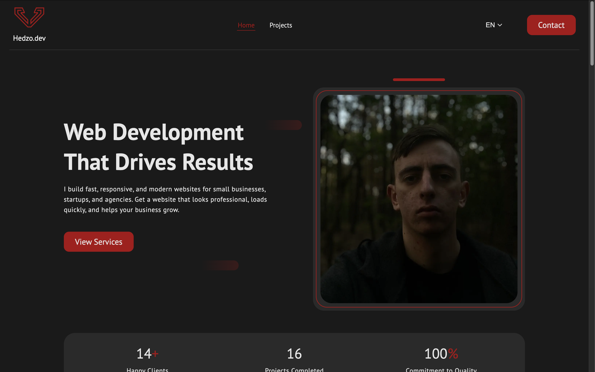

# Personal Portfolio Website

🔗 Live: https://www.hedzo.dev/

## 📖 About the Project
This is my personal portfolio website built to showcase my projects, skills, and experience as a frontend developer.

The platform includes dynamic content management powered by a headless CMS, allowing me to easily update and manage project data without modifying the codebase.

---

## 🚀 Features
- 🌍 Multi-language support  
- 📱 Fully responsive (fluid) design  
- 📂 Dynamic project loading from database  
- 🔎 Project details view with extended information  
- 📄 Pagination for project listing  
- ✉️ Contact form with email notifications  
- ⚡ Fast and optimized performance  

---

## 🛠 Tech Stack
- Next.js  
- TypeScript  
- CSS Modules  
- REST API  
- PostgreSQL  
- Directus (Headless CMS)  
- Railway (Deployment)  

---

## 🧠 What I Learned
This project helped me gain hands-on experience with:
- Integrating a headless CMS (Directus)  
- Working with PostgreSQL database  
- Designing and structuring backend data  
- Fetching and rendering dynamic content via REST API  
- Building scalable and maintainable frontend architecture  

---

---

## 📬 Contact
If you'd like to work with me or have any questions, feel free to reach out via the contact form on the website.
